# TeamKode E2E 검증 결과 (2026-06-30)

대상: **MCP 직접 호출 검증** + **워크스페이스/채팅 화면 E2E**
환경: 로컬 `npm run dev`(localhost:5173) · 운영 MCP `https://teamhub-mcp.onrender.com/mcp`(PAT 인증)
방식: MCP 도구 직접 호출 + Playwright(Chromium, 1440×900) 자동 캡처

---

## 1. 요약

| 구분 | 케이스 | 결과 |
|------|--------|------|
| MCP 인증 | 토큰 없음/오류 → 401, 유효 PAT → 200 | ✅ |
| MCP 읽기 | list_channels / list_tickets / list_projects | ✅ |
| MCP 멱등성 | create_ticket → **정확히 1건**(중복 0) | ✅ |
| MCP 수정 | update_ticket (status·priority) | ✅ |
| MCP 삭제/정리 | delete_ticket → 베이스라인 복원 | ✅ |
| 워크스페이스 전환 | 드롭다운 전환 동작 | ✅ |
| 워크스페이스 생성 | 인라인 생성 → 빈 팀 시작 | ✅ |
| **워크스페이스 격리** | 신규=0건 / 기본=1건 (화면 대비) | ✅ |
| 채팅 줄바꿈 | Shift+Enter 멀티라인 + 자동확장 | ✅ |
| 다크모드 | 토글 정상, 콘솔 에러 0 | ✅ |

> ⚠️ **발견된 갭 1건**: MCP로 생성한 티켓은 `workspace_id = null` → 워크스페이스로 필터되는 UI 목록엔 안 보임. 아래 5장 참고.

---

## 2. MCP 직접 호출 E2E (운영 서버, PAT 인증)

연결: `claude mcp add teamkode --transport http …/mcp --header "Authorization: Bearer tk_…"`

| # | 호출 | 결과 |
|---|------|------|
| 1 | `list_channels` | 6개 채널 반환, 전부 `workspace_id=기본` |
| 2 | `list_tickets` | 베이스라인 1건("메인 배너 시안 검토") |
| 3 | `list_projects` | 4개 프로젝트 반환 |
| 4 | `create_ticket("[E2E] MCP 멱등성 검증 티켓", high)` | 1건 생성 (id `65ee7ff4…`) |
| 5 | `list_tickets` | 해당 제목 **정확히 1건** (중복 없음) |
| 6 | `update_ticket(status=in_progress, priority=urgent)` | 필드 반영 확인 |
| 7 | `delete_ticket` | `{deleted: …}` |
| 8 | `list_tickets` | 베이스라인 1건으로 복원 (정리 완료) |

→ **비결정 중복/누락 없음.** 생성·수정·삭제 모두 1회 정확 동작.

---

## 3. 화면 E2E (Playwright)

### 3-1. 로그인 → 내 작업 (라이트)
임시 계정으로 로그인 성공, 사이드바·대시보드 렌더, 콘솔 에러 0.

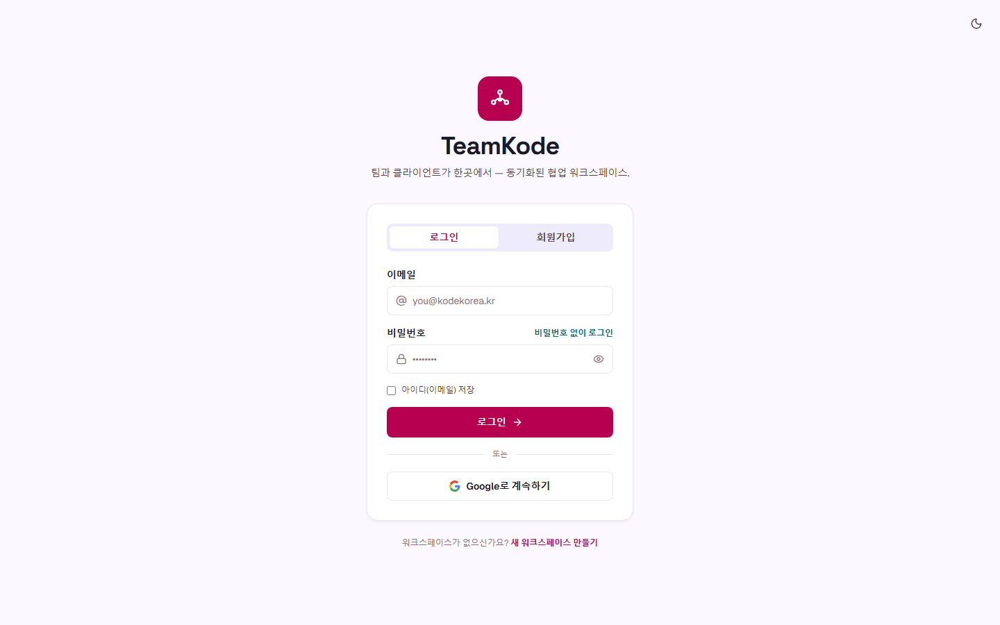
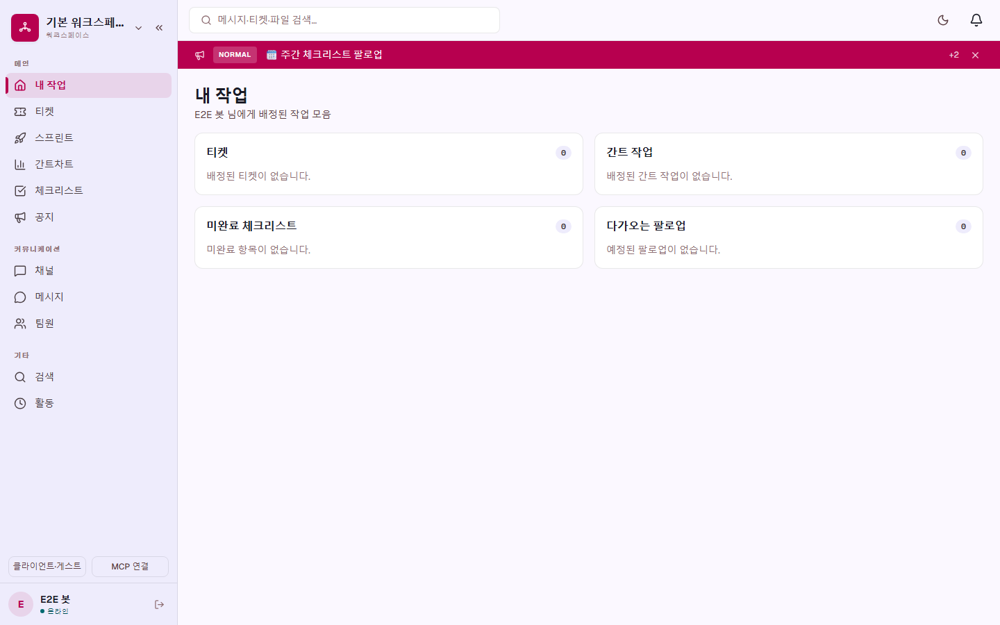

### 3-2. 워크스페이스 전환기
사이드바 상단 클릭 → "내 워크스페이스" 드롭다운 (현재=체크, "＋새 워크스페이스").

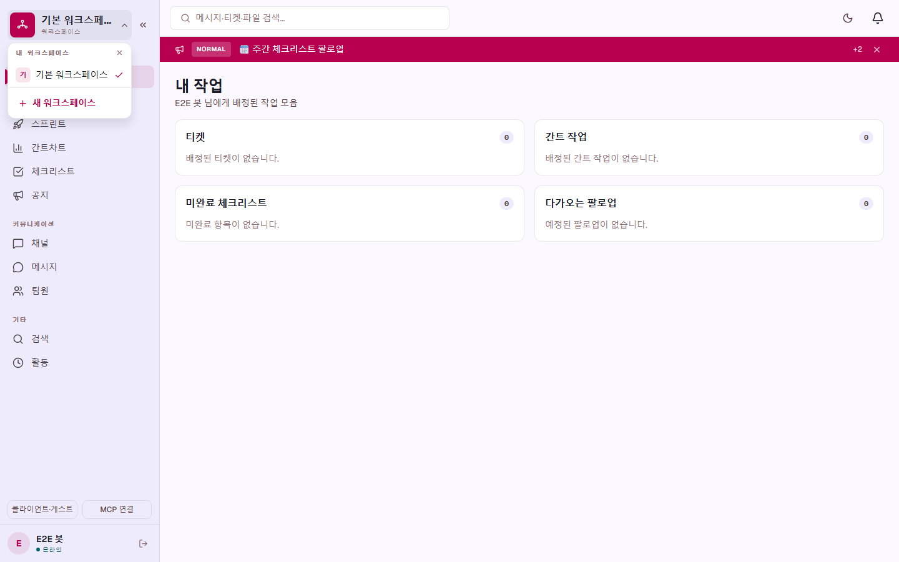

### 3-3. 새 워크스페이스 생성
인라인 입력 → 생성 → 새 워크스페이스로 자동 전환.

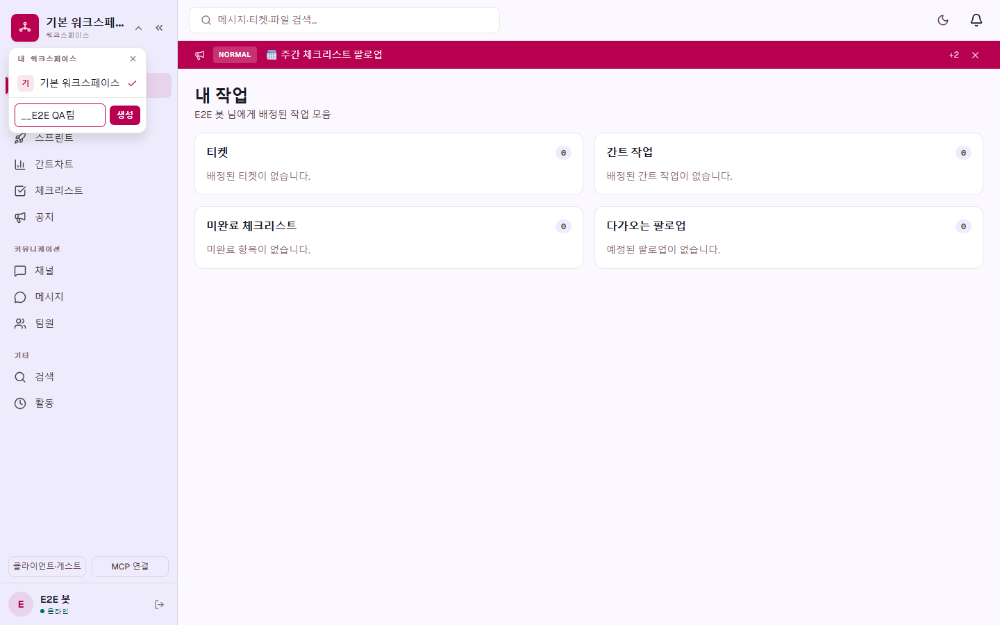

---

## 4. 워크스페이스 격리 (핵심)

같은 사용자가 워크스페이스만 바꿨을 때 데이터가 분리되는지 화면으로 대비.

| 신규 "__E2E QA팀" — **0 TICKETS (전부 EMPTY)** | 기본 워크스페이스 — **1 TICKETS** |
|---|---|
| 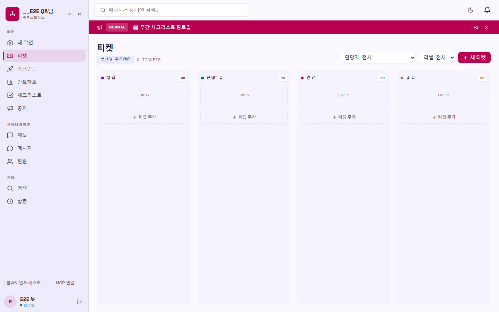 | 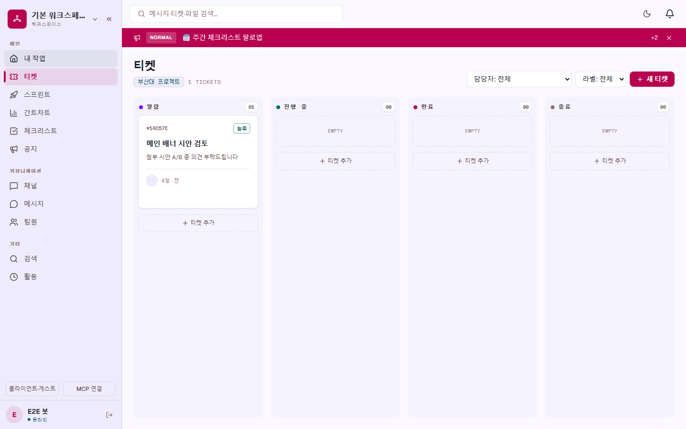 |

> DB 레벨 RLS 격리도 별도 검증 통과 (비멤버 `sees_c2=0`, 멤버 `sees_c2=1`). `0011_workspaces.sql` 적용.

---

## 5. 채팅 줄바꿈 (DM·채널 버그 수정)

`<input>` → `<textarea>` 교체. **Enter=전송, Shift+Enter=줄바꿈**, 한글 IME 오전송 방지, 높이 자동확장.

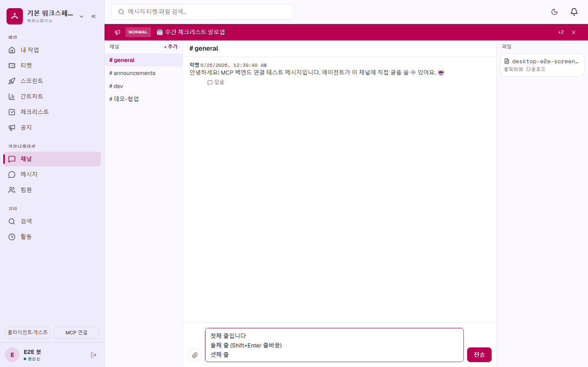

---

## 6. 다크모드

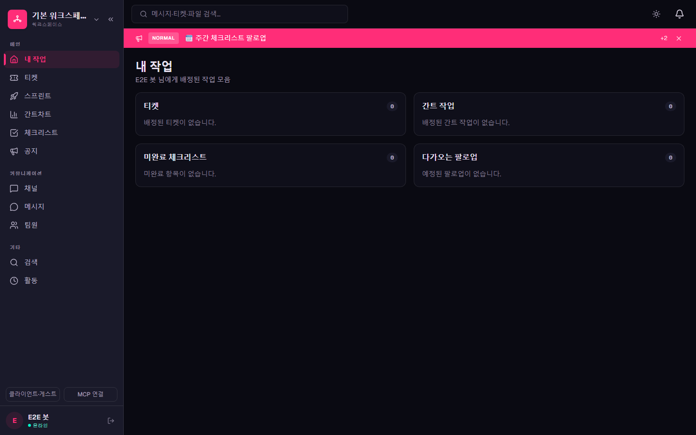

---

## 7. 발견 사항 / 후속 과제

1. ~~**MCP 생성물의 워크스페이스 미지정** (갭)~~ → **✅ 해결됨 (A안 배포)**
   MCP 생성 도구(`create_channel·post_announcement·create_ticket·create_project`)에 `workspace` 인자 추가 +
   미지정 시 **기본 워크스페이스 자동 귀속**. 운영 배포 후 검증: `create_ticket` → `workspace_id=8d91c6c2…`(기본).

2. **하위 엔티티 격리는 상속 의존**
   sprints/gantt/checklists는 프로젝트 목록이 워크스페이스로 필터되는 것에 의존(내부 신뢰 모델). 완전 격리는 PAT→user RLS 스코프 단계에서 강화.

3. 운영 배포 필요: 이번 변경(워크스페이스 + 줄바꿈)은 **로컬 검증 완료, 아직 미배포**.

---

## 8. 롤(관리자/팀원/외부인) + 마이페이지 (추가)

3-롤 정립: **admin(관리자) · member(팀원) · guest(외부인)**. `seongho.cho@kodekorea.kr` 만 관리자.

| 항목 | 결과 |
|------|------|
| 워크스페이스 생성 = 관리자 전용 | ✅ RLS `workspaces_insert` = `auth_is_admin()` |
| 자가 권한상승 차단 | ✅ 팀원이 자기 `role='admin'` 시도 → `member` 유지(트리거), 일반 수정은 허용 |
| 마이페이지 | ✅ 이름 수정·이메일·역할 배지·소속 워크스페이스 |
| 사이드바 관리자 배지 | ✅ |

| 마이페이지(팀원) | 전환기 — 팀원(생성 잠김) | 전환기 — 관리자(생성 가능) |
|---|---|---|
| 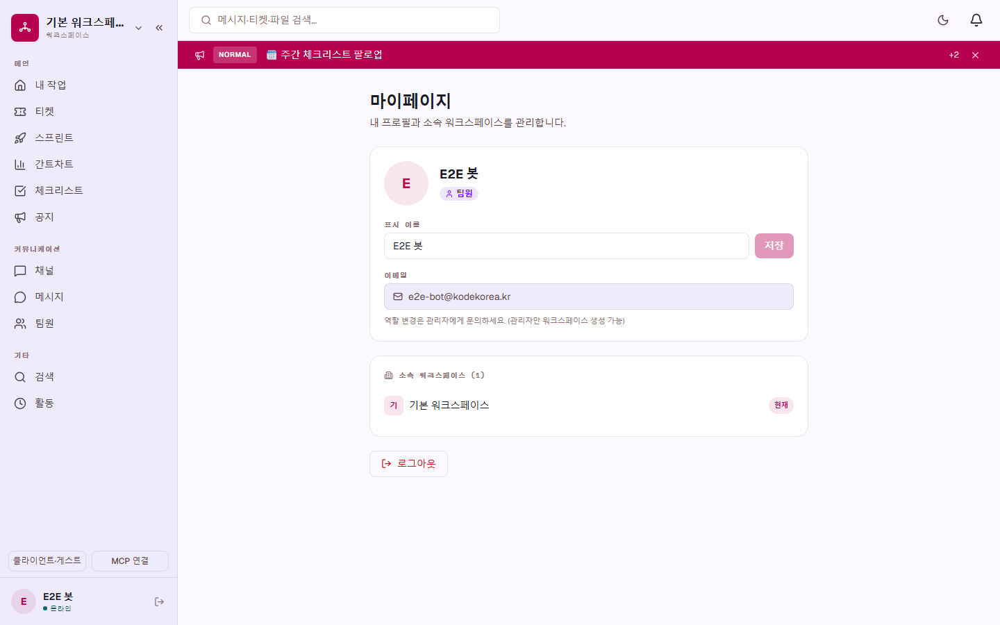 | 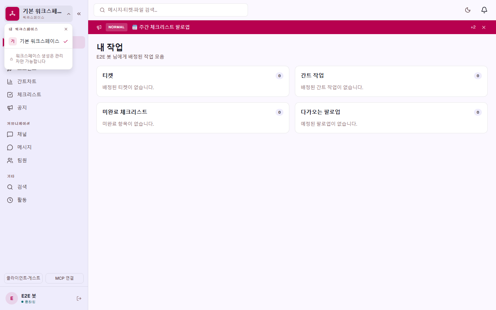 | 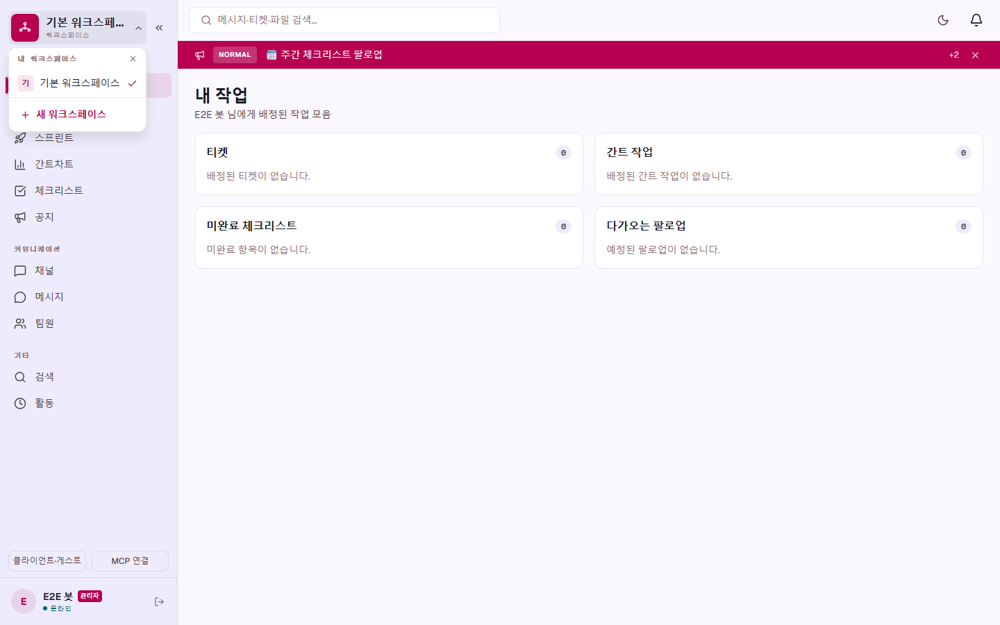 |

---

## 9. DB 복구(휴지통) (추가)

모든 삭제 행을 트리거로 `deleted_records` 에 자동 보관 → 관리자가 복원. UI/MCP/연쇄삭제 어떤 경로든 포착.

| 항목 | 결과 |
|------|------|
| 삭제 자동 보관 | ✅ 티켓 삭제 → `deleted_records`에 제목 포함 보관 |
| 관리자 복원 | ✅ `restore_deleted_record` → 원본 테이블 재삽입 + 아카이브 제거 |
| 팀원 복원 거부 | ✅ `관리자만 복구할 수 있습니다` |
| 휴지통 UI | ✅ 타입 필터·복구 버튼 (관리자 전용 메뉴) |

| 휴지통 목록 (삭제 4건) | 1건 복구 후 (3건) |
|---|---|
| 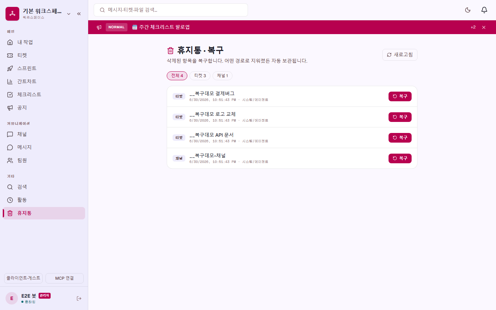 | 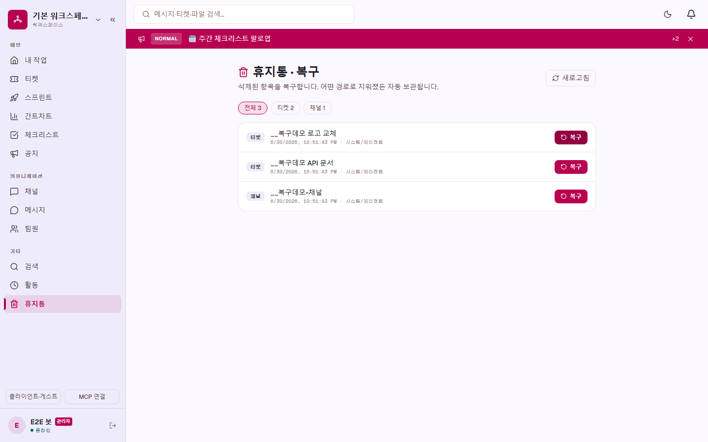 |

> 보관 대상: workspaces·channels·messages·files·announcements·tickets·ticket_comments·projects·gantt_tasks·sprints·checklists·checklist_items·reactions. 상위가 함께 삭제된 경우 상위 먼저 복구.

---

## 10. 스프린트·체크리스트·팀원 워크스페이스 스코프 + 설정 (추가)

이전엔 채널·티켓·공지·프로젝트만 워크스페이스로 묶여, **스프린트·체크리스트·팀원은 전 워크스페이스 공유**되는 버그가 있었음 → 수정.

| 항목 | 결과 |
|------|------|
| 스프린트/체크리스트 workspace_id 추가·백필 | ✅ (0014) |
| 스프린트·체크리스트 UI 워크스페이스 필터 | ✅ |
| 팀원(People) = 현재 워크스페이스 멤버만 | ✅ 신규 워크스페이스 2명 vs 기본 8명 |
| MCP create_sprint/create_checklist 워크스페이스 귀속 | ✅ |
| 워크스페이스 이름 변경 | ✅ |
| 워크스페이스 멤버 추가/제외 (관리자) | ✅ |

> 실데이터 확인: "진주경상대" 워크스페이스 = 체크리스트 0·스프린트 0·멤버 1명 (다른 워크스페이스 데이터 더 이상 안 보임).

| 워크스페이스 설정(이름·멤버) | 팀원 — 새 워크스페이스(2명) | 팀원 — 기본(8명) |
|---|---|---|
| 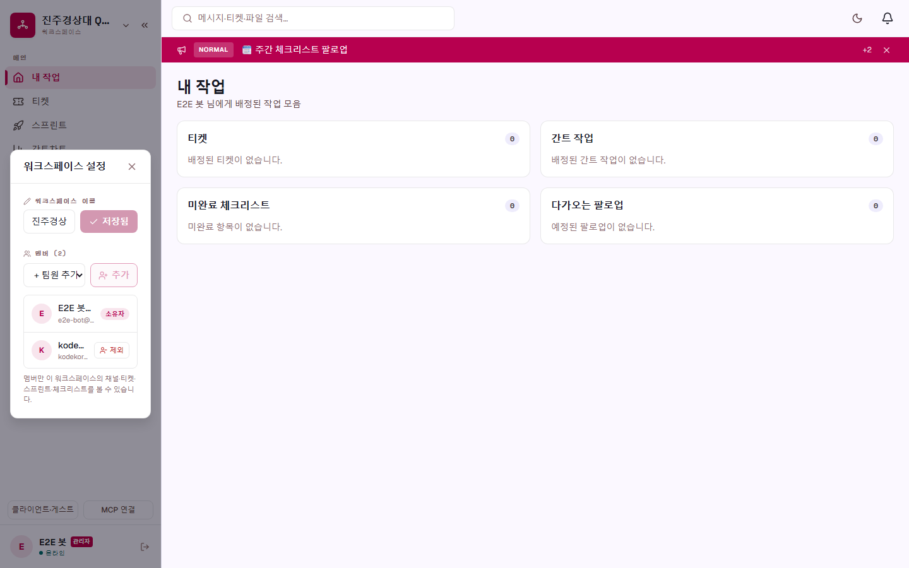 | 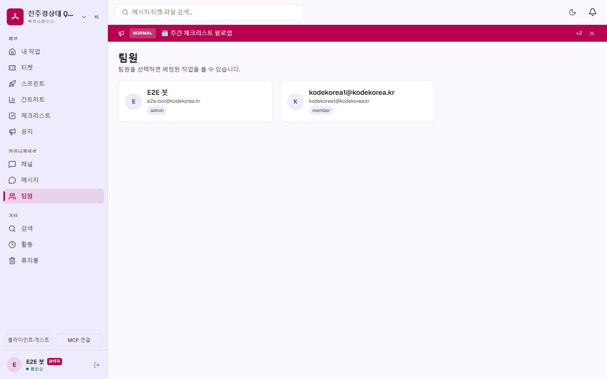 | 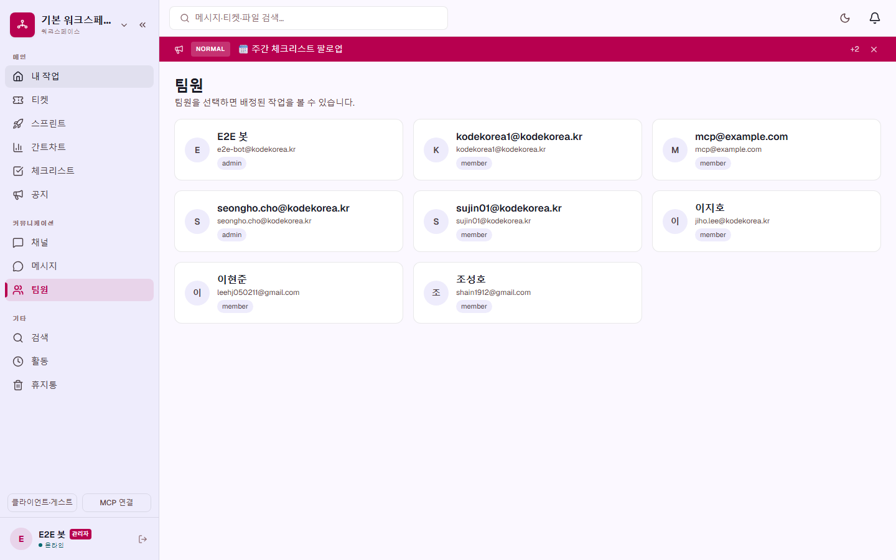 |

---

## 11. 워크스페이스 초대(공유링크·이메일) + 초대 기반 소속 (추가)

가입만으로 자동 소속되던 걸 없애고, **초대(공유링크/1인용 이메일) 또는 관리자 추가로만 소속**되도록 변경 — 외부인(guest) 격리 누수 차단.

| 항목 | 결과 |
|------|------|
| 가입 직후 자동편입 없음 | ✅ 멤버십 0 |
| 초대링크 → 로그인 후 자동 수락 → 해당 워크스페이스 입장 | ✅ 멤버·게스트 모두 |
| 게스트 초대 → global role=guest 확정 격리 | ✅ |
| 기본 워크스페이스 미편입 | ✅ 멤버·게스트 모두 |
| RLS: 비소유자 초대 생성 차단 | ✅ |

실계정(임시) E2E 15/15 통과. 리뷰에서 트리거 권한상승 우회 로직도 검증(admin 자가승격 불가).

| 멤버 초대로 입장 | 게스트 초대로 입장 |
|---|---|
| 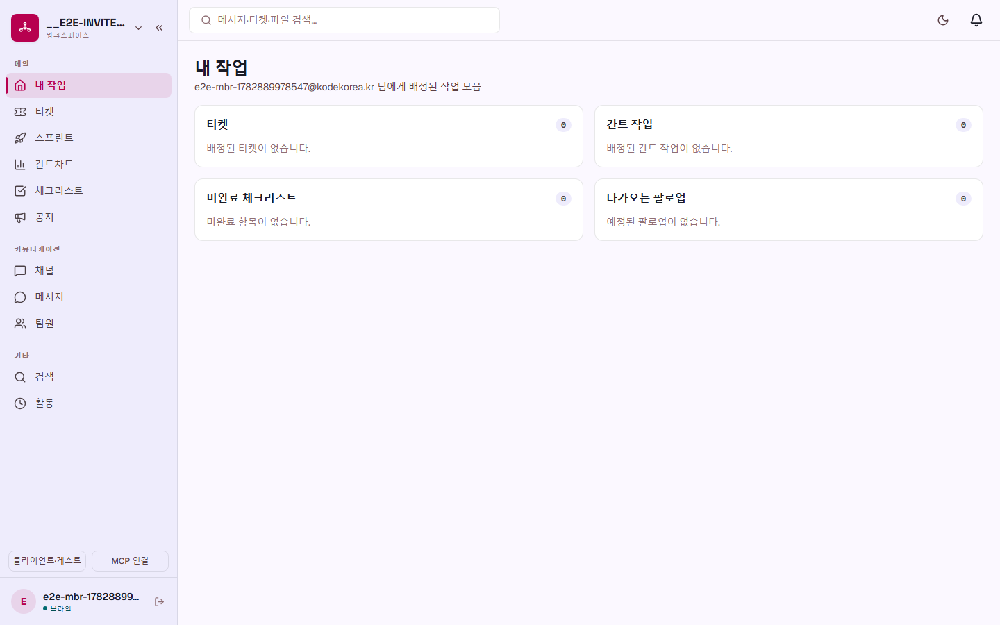 |  |

---

## 12. 모바일 UI 정비 — PWA·하단탭·반응형·사이드바 모달 버그 (추가)

### 12-1. PWA 설치형 앱화
매니페스트·서비스워커·브랜드 아이콘 적용, 사이드바 "앱 설치" 버튼(`beforeinstallprompt` 유도 + iOS 안내).

### 12-2. 모바일 하단 탭바
좌상단 햄버거 의존을 줄이기 위해 엄지 도달 범위의 하단 탭(내작업·티켓·채널·메시지·더보기) 추가. 게스트는 채널·티켓만.

| 내 작업 | 티켓(하단탭) | 채널 |
|---|---|---|
| 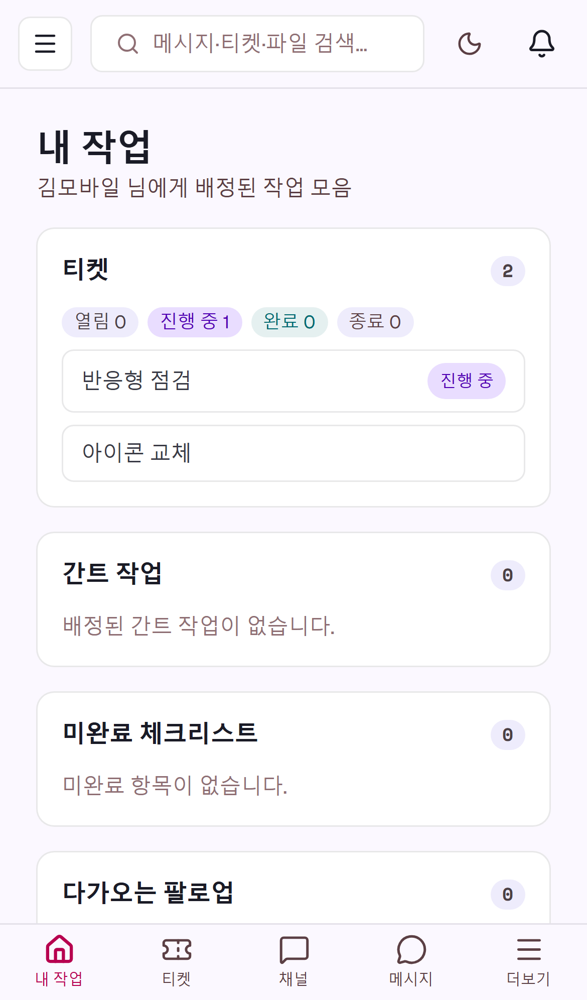 | 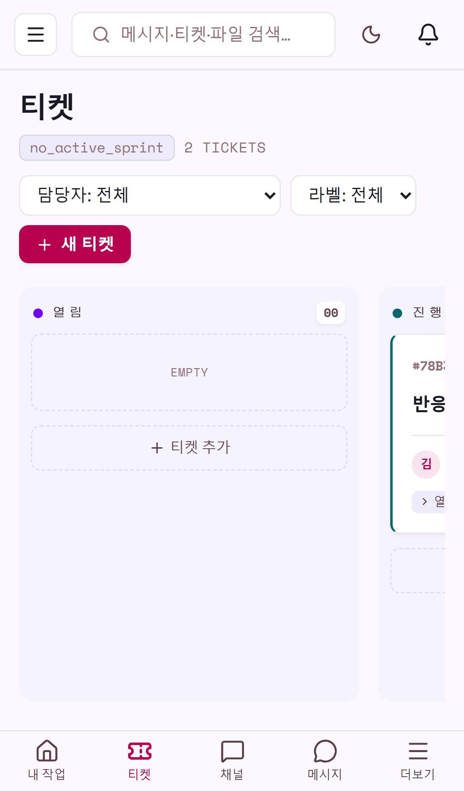 | 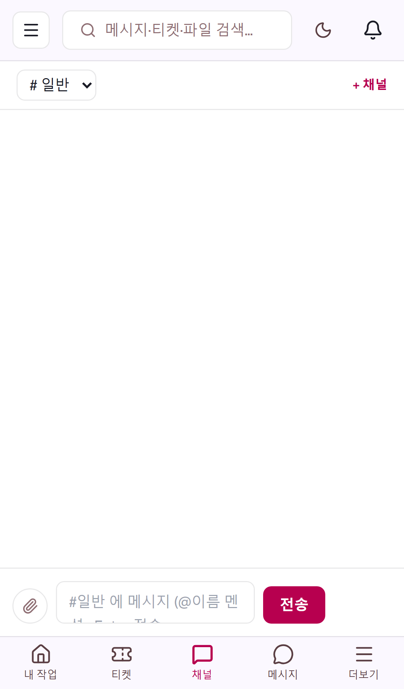 |

### 12-3. 티켓 보드 / 간트차트 모바일 전용 뷰
데스크톱 4열 칸반·고정폭 타임라인 테이블을 모바일 그대로 얹었더니 빈 칼럼이 화면을 다 채우거나(티켓) 타임라인이 거의 안 보이는(간트) 문제 발견 → 모바일 전용 레이아웃으로 교체. 데스크톱은 완전히 그대로.

| 티켓 — 이전(가로캐러셀) | 티켓 — 이후(상태 세그먼트탭) | 간트 — 이전(라벨열이 화면 다 차지) | 간트 — 이후(세로 로드맵카드) |
|---|---|---|---|
| 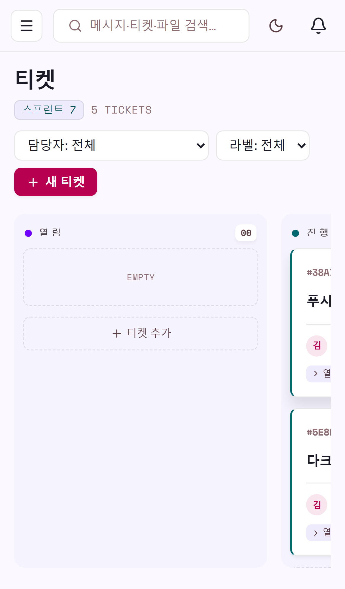 | 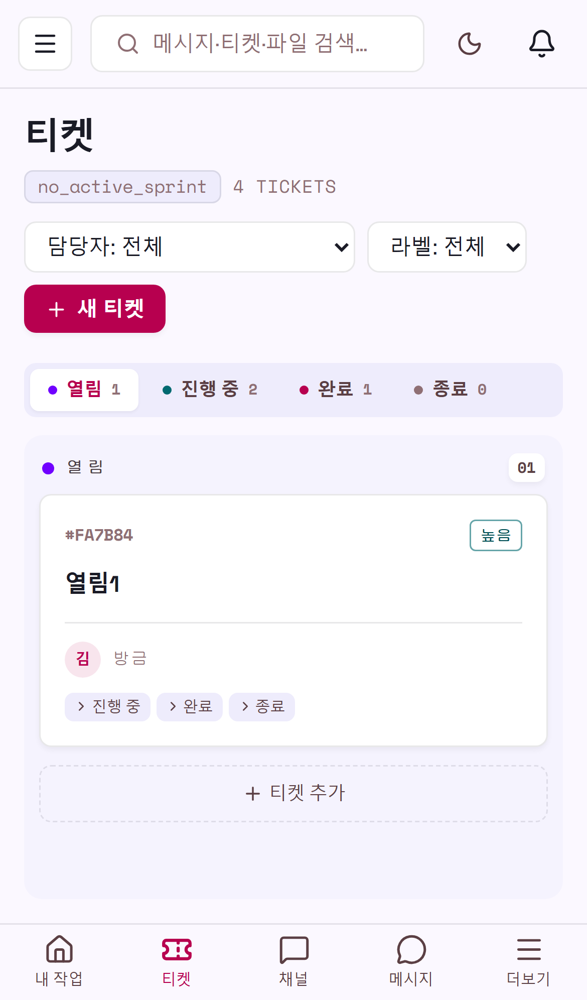 | 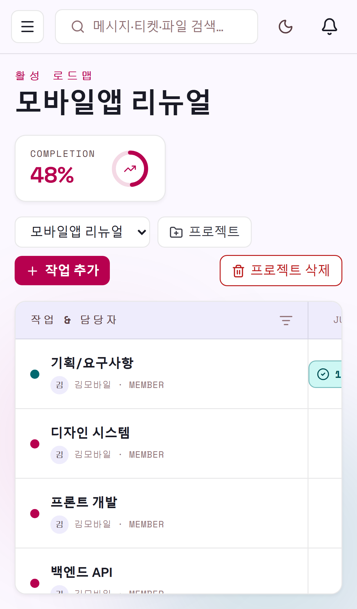 | 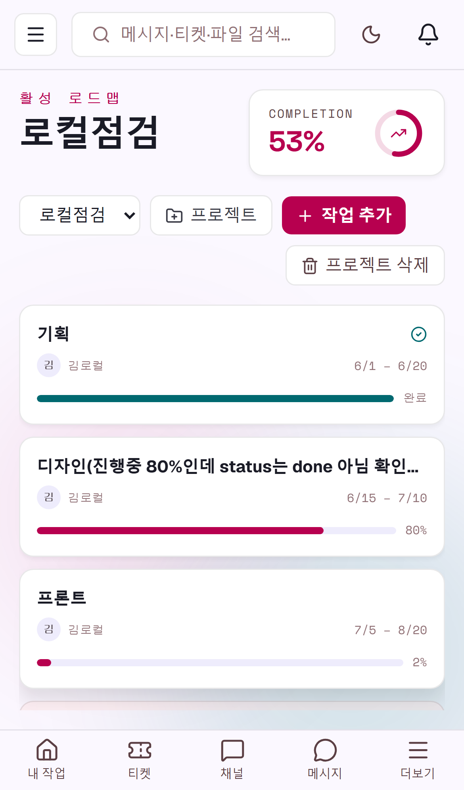 |

### 12-4. 사이드바 내부 모달이 사이드바 폭에 갇히는 버그
`WorkspaceSettings`(워크스페이스 설정·초대 UI)와 `InstallAppButton`의 iOS 안내 모달이 `Sidebar`의 `<aside>` 내부에서 렌더링되는데, 그 `<aside>`에 모바일 드로어 애니메이션용 `translate-x-*`(transform)가 항상 걸려 있어 **CSS 스펙상 `position:fixed` 자식의 기준 박스가 뷰포트가 아니라 사이드바 자신으로 바뀌는 버그**. 전체화면 중앙 모달이어야 할 게 사이드바 폭(256px) 안에 눌려 텍스트가 다 깨져 보였음 → `createPortal(..., document.body)`로 두 모달을 사이드바 DOM 트리 밖에 렌더링해 해결.

| 버그 재현(사이드바 폭에 갇힘) | 수정 후(정상 512px 중앙 모달) |
|---|---|
| 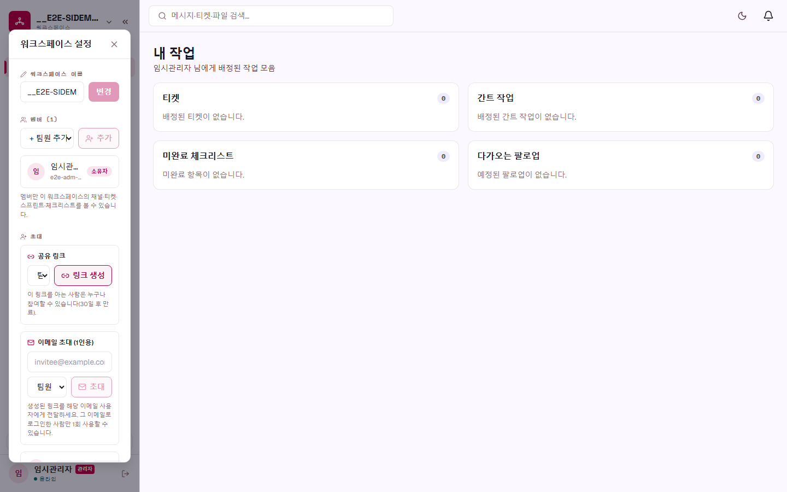 | 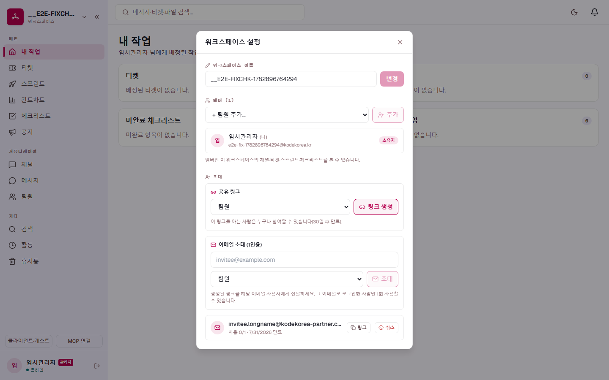 |

### 12-5. Capacitor Android 네이티브 셸 (탐색, 보류)
앱스토어 등재 목적으로 Capacitor로 기존 웹앱을 그대로 감싸는 Android 프로젝트를 만들어 로컬에서 빌드·에뮬레이터 실행·로그인까지 end-to-end 확인(디자인 손실 0). **스토어 제출·iOS·OAuth 딥링크 대응은 사용자 요청으로 보류**, 코드는 `android/`·`capacitor.config.ts`에 커밋된 상태로 남겨둠.

---

## 부록 — 재현 방법

```bash
npm run dev                 # localhost:5173
# 임시 확인 계정은 admin API로 생성 후 테스트 종료 시 삭제(정리 완료)
# 스크린샷: docs/e2e-results/shots/*.png
```
</content>
