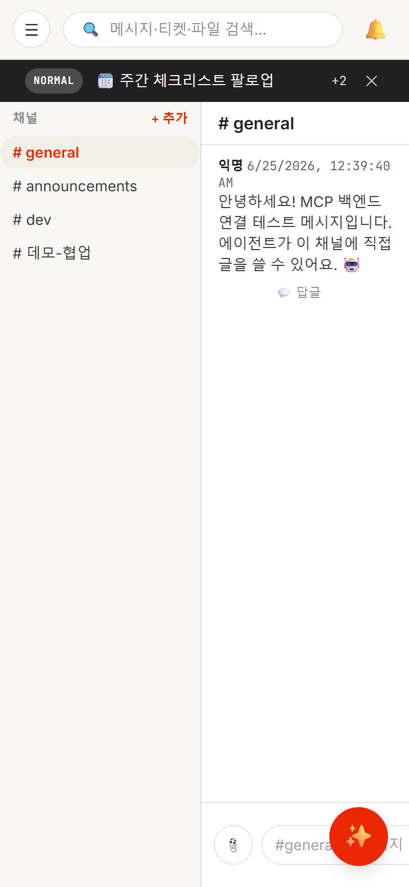
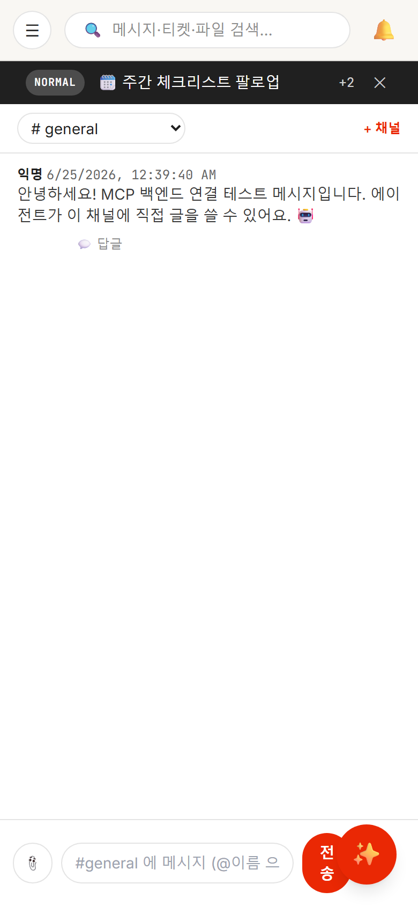
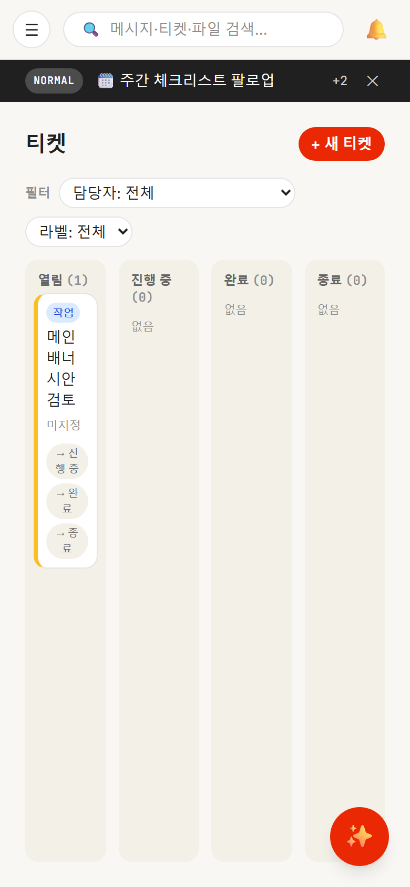
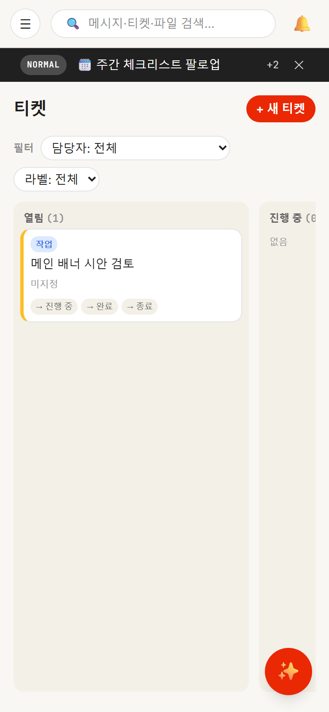
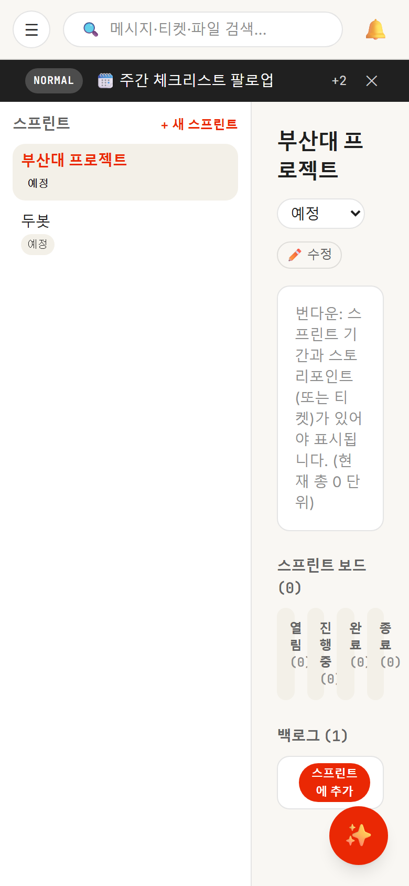
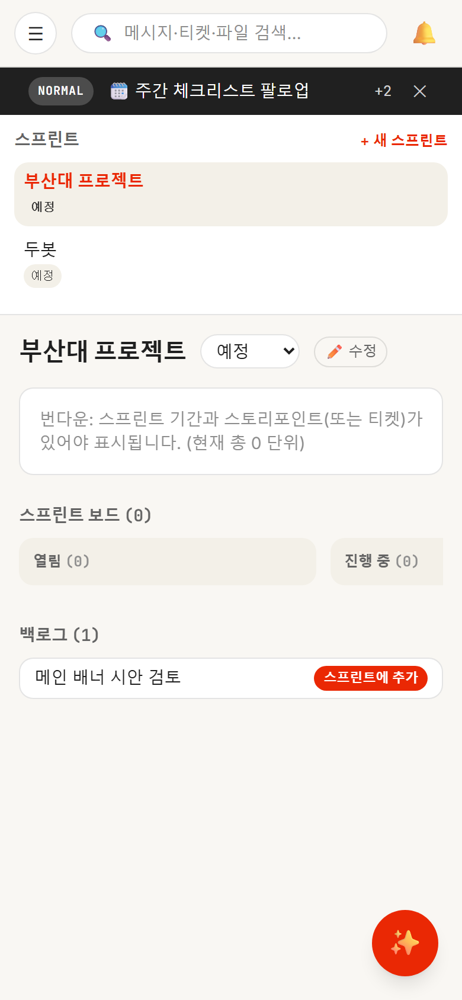
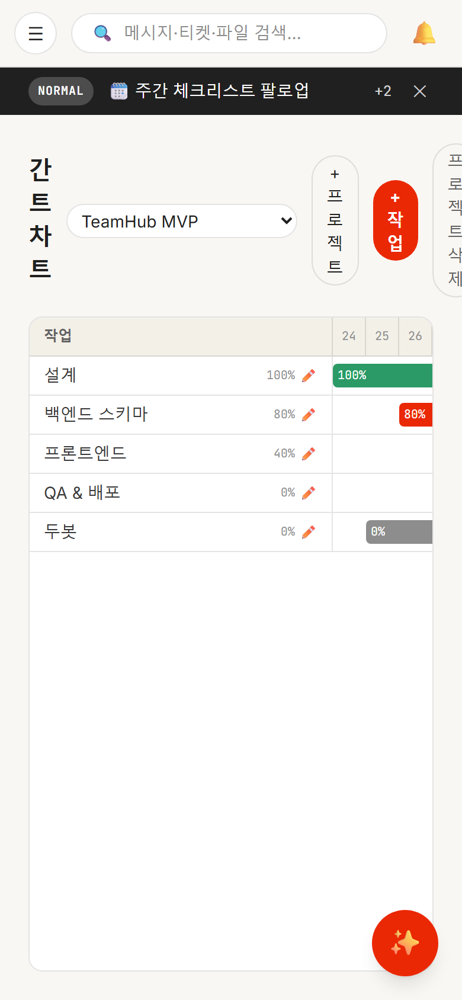
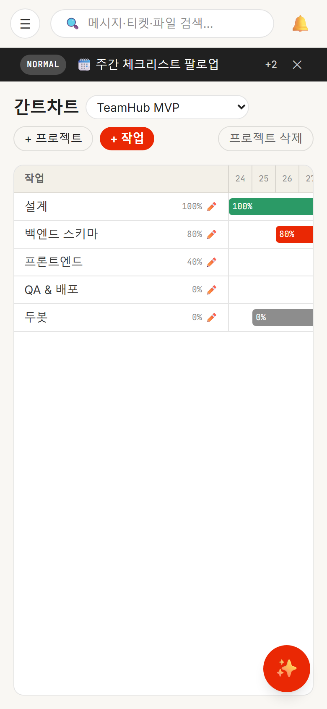
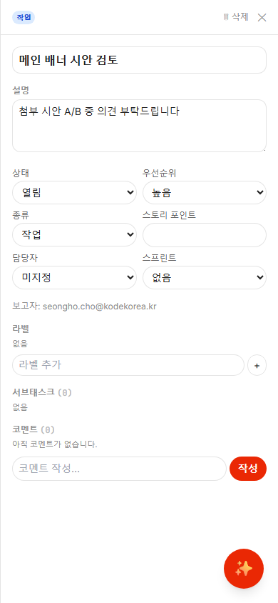

# 모바일 반응형 개편 — E2E 검증 리포트

- **커밋:** `338fd9e` fix: 모바일 반응형 전면 개편 (프로덕션 라이브)
- **검증 도구:** Playwright + Chromium, 390×844 모바일 뷰포트 (isMobile, hasTouch)
- **방법:** 임시 계정 로그인 → 전 페이지 스크린샷 + 가로 오버플로우(scrollWidth − innerWidth) 측정 → 수정 → 재촬영
- **결과:** 전 페이지 가로 오버플로우 ✅ **0px**

---

## 수정 요약

| 페이지 | before 문제 | after 수정 |
|--------|------------|-----------|
| **채널** | 사이드바가 화면 절반 차지, 메시지 잘림, 입력창이 AI 버튼에 가림 | 사이드바 숨김 → 상단 드롭다운, 메시지 풀폭, 입력창 우측 패딩 확보 |
| **티켓** | 4칸 칸반이 세로로 찌그러져 글자 한 자씩 줄바꿈 | 가로 스크롤 + 컬럼 폭 78%, 카드 정상 표시 |
| **스프린트** | 좌우 2분할이 모바일에서 깨짐, 보드 칸 찌그러짐 | 세로 스택 + 보드 가로 스크롤 |
| **간트** | 헤더 버튼들이 가로로 넘쳐 세로로 잘림 | flex-wrap 줄바꿈 |
| **티켓 상세** | 데스크탑 사이드패널이 모바일에 안 맞음 | 전체화면 오버레이 |

> 체크리스트·공지·피플·검색·알림·감사 페이지는 원래 깨짐이 없어 변경하지 않음.

---

## Before / After

### 채널
| Before | After |
|--------|-------|
|  |  |

### 티켓 (칸반)
| Before | After |
|--------|-------|
|  |  |

### 스프린트
| Before | After |
|--------|-------|
|  |  |

### 간트차트
| Before | After |
|--------|-------|
|  |  |

### 티켓 상세 (after — 전체화면 오버레이)

---

## 적용한 핵심 패턴 (Tailwind, mobile-first)

- 데스크탑 전용 다중 패널은 `lg:` 분기 — 모바일은 단일 컬럼/오버레이, `lg` 이상에서 기존 레이아웃 복원
- 칸반/보드: 모바일 `overflow-x-auto` + 퍼센트 폭 카드 → `lg:grid lg:grid-cols-4`
- 헤더 컨트롤: `flex flex-wrap` 로 좁은 폭에서 줄바꿈
- 상세 패널: 모바일 `fixed inset-0 z-40` 전체화면 → `lg:static lg:w-[26rem]` 사이드패널
